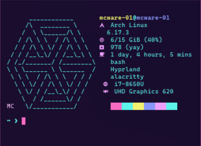

# NerdFetch - ZB Remix
My personal remix of NerdFetch made with the help of Claude Code, thank you to @ThatOneCalculator https://github.com/ThatOneCalculator/NerdFetch

This remix includes custom features:
- GPU detection with VRAM usage and percentage
- CPU, Shell, Window Manager, and Terminal detection
- Memory display in GiB instead of MiB
- Disk usage display showing used/free GB for all mounted drives
- Custom MC cube ASCII art in teal with bright purple "MC" signature
- Fixed ANSI color code rendering



### Dependencies

- [Any Nerdfonts font](https://www.nerdfonts.com/font-downloads), [Cozette](https://github.com/slavfox/Cozette), or [Phosphor](https://github.com/phosphor-icons/homepage/releases/tag/v2.0.0)
- [POSIX.1-2017 compliant shell](#shells-tested)
- [Anything but Windows](#oses-tested)

### Installation

#### Build from source

```sh
# Clone the repository
git clone https://github.com/zaphod-black/NerdFetch-ZBRemix.git
cd NerdFetch-ZBRemix

# Install to /usr/bin
sudo install -m 755 nerdfetch /usr/bin/nerdfetch

# Run it
nerdfetch
```

#### How to switch fonts

- Nerdfonts is used by default
- Use `-c` for Cozette
- Use `-p` for Phosphor
- Use `-e` for Emojis

### Features

- Strong cross-OS compatability
- Not bloated
- Portable
- POSIX

### OSes tested

- Debian based Linux
- Ubuntu based Linux
- Arch based Linux
- Gentoo based Linux
- RedHat based Linux
- OpenSUSE based Linux
- Bedrock Linux
- Alpine Linux
- KISS Linux
- Void Linux
- Exherbo Linux
- NixOS Linux
- Solus Linux
- yiffOS Linux
- Slackware Linux
- BirbOS Linux
- macOS
- Android
- FreeBSD
- OpenBSD
- NetBSD
- OpenWrt

### Shells tested

- Bourne Again Shell (`bash`)
- Z Shell (`zsh`)
- Almquist Shell (`ash`), Debian Almquist Shell (`dash`)  
- KornShell (`ksh`), MirBSD KornShell (`mksh`)
- Oil Shell (`osh`)
- Yet Another Shell (`yash`)

### Known issue(s)

- `nsh` is currently unsupported
